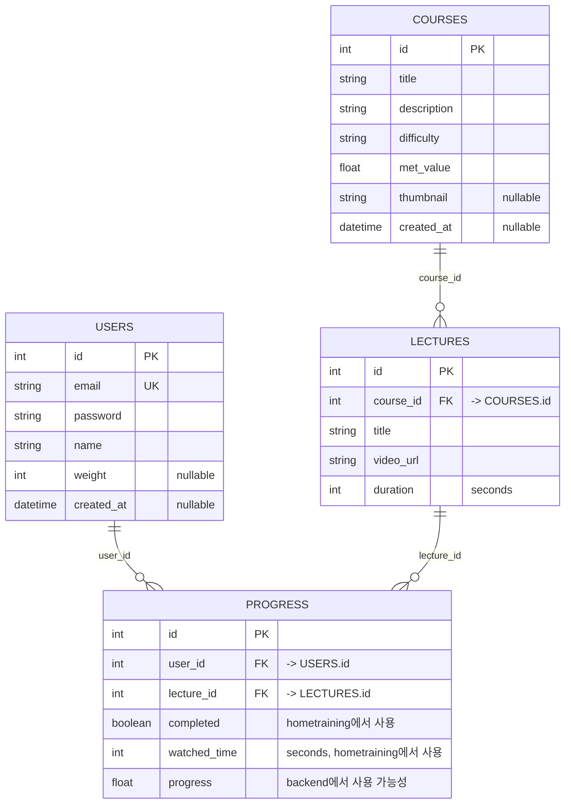

```mermaid
erDiagram
  USERS ||--o{ PROGRESS : "user_id"
  COURSES ||--o{ LECTURES : "course_id"
  LECTURES ||--o{ PROGRESS : "lecture_id"

  USERS {
    int id PK
    string email UK
    string password
    string name
    int weight "nullable"
    datetime created_at "nullable"
  }

  COURSES {
    int id PK
    string title
    string description
    string difficulty
    float met_value
    string thumbnail "nullable"
    datetime created_at "nullable"
  }

  LECTURES {
    int id PK
    int course_id FK "-> COURSES.id"
    string title
    string video_url
    int duration "seconds"
  }

  PROGRESS {
    int id PK
    int user_id FK "-> USERS.id"
    int lecture_id FK "-> LECTURES.id"
    boolean completed "hometraining에서 사용"
    int watched_time "seconds, hometraining에서 사용"
    float progress "backend에서 사용 가능성"
    %% (user_id, lecture_id) UNIQUE 권장 (upsert 로직 존재)
  }
```