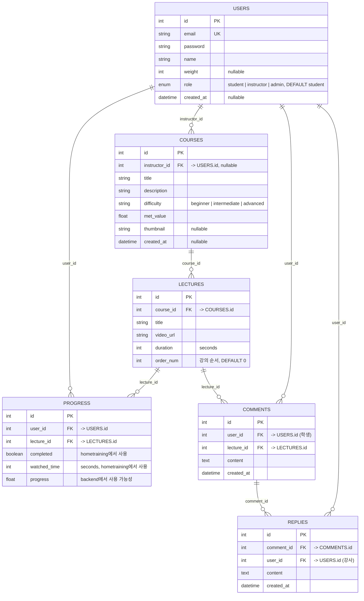

## SQL 마이그레이션

```sql
-- 1. USERS 테이블에 role 컬럼 추가
ALTER TABLE users
  ADD COLUMN role ENUM('student', 'instructor', 'admin') NOT NULL DEFAULT 'student';

-- 2. COURSES 테이블에 instructor_id 추가
ALTER TABLE courses
  ADD COLUMN instructor_id INT NULL,
  ADD FOREIGN KEY (instructor_id) REFERENCES users(id) ON DELETE SET NULL;

-- 3. LECTURES 테이블에 order_num 추가
ALTER TABLE lectures
  ADD COLUMN order_num INT NOT NULL DEFAULT 0;

-- 4. COMMENTS 테이블 생성
CREATE TABLE IF NOT EXISTS comments (
  id INT PRIMARY KEY AUTO_INCREMENT,
  user_id INT NOT NULL,
  lecture_id INT NOT NULL,
  content TEXT NOT NULL,
  created_at DATETIME DEFAULT CURRENT_TIMESTAMP,
  FOREIGN KEY (user_id) REFERENCES users(id) ON DELETE CASCADE,
  FOREIGN KEY (lecture_id) REFERENCES lectures(id) ON DELETE CASCADE
);

-- 5. REPLIES 테이블 생성
CREATE TABLE IF NOT EXISTS replies (
  id INT PRIMARY KEY AUTO_INCREMENT,
  comment_id INT NOT NULL,
  user_id INT NOT NULL,
  content TEXT NOT NULL,
  created_at DATETIME DEFAULT CURRENT_TIMESTAMP,
  FOREIGN KEY (comment_id) REFERENCES comments(id) ON DELETE CASCADE,
  FOREIGN KEY (user_id) REFERENCES users(id) ON DELETE CASCADE
);
```
