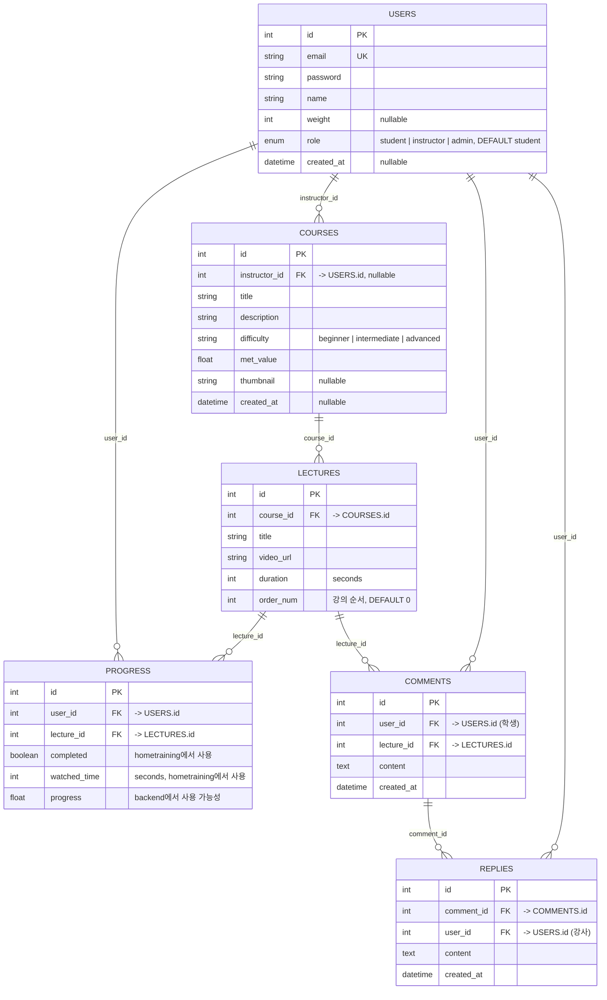

# 1~2주차 개발 설계 문서

> 작성일: 2026-04-09  
> 브랜치: `claude/distracted-northcutt`  
> 담당: 기초 인프라, 인증 시스템, 강의 조회·시청, 진도 관리, 학생 대시보드

---

## 개요

프로젝트의 첫 2주는 서비스의 핵심 뼈대를 구성하는 단계였다.  
백엔드는 **Node.js + Express + MySQL2**, 프론트엔드는 **Next.js 16 (App Router) + React 19**로 구성하고,  
JWT 기반 인증, 강의 목록 조회, 강의 영상 시청, 진도 추적, 학생 대시보드를 순서대로 구현했다.

---

## 1. 프로젝트 구조 설계

### 디렉토리 구성

```
school_project/
├── backend/                  # Express.js API 서버
│   ├── app.js                # 서버 진입점, 라우트 등록
│   ├── db.js                 # MySQL2 커넥션 풀
│   ├── controllers/          # 비즈니스 로직
│   ├── middleware/           # JWT 검증 미들웨어
│   └── routes/               # 라우트 정의
└── hometraining/             # Next.js 16 클라이언트
    └── src/
        ├── app/
        │   ├── (auth)/       # 로그인 / 회원가입
        │   └── (main)/       # 인증 후 접근 페이지
        ├── components/       # 공통 컴포넌트 (Navbar 등)
        ├── hooks/            # 커스텀 훅 (useAuth, useProgress)
        ├── lib/              # API 클라이언트, mockData
        └── types/            # TypeScript 타입 정의
```

### 기술 스택 선정 근거

| 영역 | 선택 | 근거 |
|------|------|------|
| 백엔드 | Express.js | 경량, 빠른 라우팅, 미들웨어 생태계 |
| ORM | MySQL2 (raw SQL) | JOIN 구조가 명확해 ORM보다 직접 쿼리가 가독성 높음 |
| 인증 | JWT (jsonwebtoken) | Stateless, 서버 세션 없이 수평 확장 가능 |
| 프론트 | Next.js 16 App Router | 파일 기반 라우팅, React 서버 컴포넌트 지원 |
| 스타일 | CSS Variables (globals.css) | 다크모드 토큰 일괄 관리, 라이브러리 의존 최소화 |

---

## 2. 데이터베이스 설계

### ERD



### 테이블 설계 원칙

- `PROGRESS` 테이블은 `(user_id, lecture_id)` 복합 유니크로 **upsert** 처리 → 중복 진도 레코드 방지
- `COURSES.instructor_id`는 `nullable` + `ON DELETE SET NULL` → 강사 탈퇴 시 강의 데이터 보존
- `COMMENTS` / `REPLIES`는 `ON DELETE CASCADE` → 상위 레코드 삭제 시 자동 정리

---

## 3. 백엔드 구현

### 3-1. DB 연결 (`backend/db.js`)

MySQL2의 `createPool`을 사용해 커넥션 풀을 생성했다.  
직접 쿼리 함수(`db.query`)를 콜백 방식으로 사용하며, 필요 시 `Promise.all`로 병렬 처리했다.

```js
const pool = mysql.createPool({
  host: process.env.DB_HOST,
  user: process.env.DB_USER,
  password: process.env.DB_PASSWORD,
  database: process.env.DB_NAME,
  waitForConnections: true,
  connectionLimit: 10,
});
module.exports = pool;
```

### 3-2. 인증 (`backend/controllers/authController.js`)

**회원가입 (`POST /api/auth/register`)**:
1. 이메일 중복 확인 (`SELECT` 후 409 반환)
2. `bcrypt.hash(password, 10)`으로 비밀번호 해시 후 저장
3. 저장된 유저 ID로 JWT 발급 후 응답

**로그인 (`POST /api/auth/login`)**:
1. 이메일로 유저 조회
2. `bcrypt.compare`로 비밀번호 검증
3. JWT payload에 `{ id }` 포함, `expiresIn: '1h'` 설정

```js
const token = jwt.sign({ id: user.id }, process.env.JWT_SECRET, { expiresIn: '1h' });
res.json({ token, user: { id, email, name } });
```

**내 정보 조회 (`GET /api/auth/me`)**:
- `authMiddleware`를 통과한 뒤 `req.user.id`로 DB에서 유저 정보 조회 후 반환

### 3-3. JWT 미들웨어 (`backend/middleware/authMiddleware.js`)

```js
const token = req.headers.authorization?.split(' ')[1]; // Bearer {token}
const decoded = jwt.verify(token, process.env.JWT_SECRET);
req.user = decoded; // { id }
next();
```

### 3-4. 강의 API (`backend/controllers/courseController.js`)

| 메서드 | 경로 | 설명 |
|--------|------|------|
| GET | `/api/courses` | 전체 강의 목록 |
| GET | `/api/courses/:id` | 강의 상세 |
| GET | `/api/courses/:id/lectures` | 강의에 속한 영상 목록 |

- 영상 목록은 `ORDER BY order_num ASC`로 재생 순서를 보장한다.

### 3-5. 진도 API (`backend/controllers/progressController.js`)

| 메서드 | 경로 | 설명 |
|--------|------|------|
| GET | `/api/progress` | 내 전체 진도 (강의 ID 배열 → 일괄 조회) |
| POST | `/api/progress/:lectureId` | 진도 저장 (upsert) |

**Upsert 패턴** — `INSERT ... ON DUPLICATE KEY UPDATE`:
```sql
INSERT INTO progress (user_id, lecture_id, completed, watched_time)
VALUES (?, ?, ?, ?)
ON DUPLICATE KEY UPDATE
  completed = VALUES(completed),
  watched_time = VALUES(watched_time);
```
- 같은 영상을 여러 번 저장해도 레코드가 중복 생성되지 않는다.

---

## 4. 프론트엔드 구현

### 4-1. 전역 스타일 (`hometraining/src/app/globals.css`)

다크 테마를 CSS 변수(Custom Property)로 관리했다.

```css
:root {
  --bg-base:      #0f0f0f;
  --bg-card:      #1a1a1a;
  --bg-elevated:  #252525;
  --border:       #2e2e2e;
  --text-primary: #f0f0f0;
  --text-secondary: #888;
  --accent:       #e53e3e;
  --green:        #22c55e;
}
```

- 모든 컴포넌트는 하드코딩 색상 대신 변수를 사용해 테마 변경에 유연하게 대응한다.
- `.card`, `.btn-ghost`, `.badge-*`, `.progress-bar`, `.spinner`, `.fade-in` 등 유틸리티 클래스를 전역 정의.

### 4-2. API 클라이언트 (`hometraining/src/lib/api.ts`)

모든 fetch 호출을 `apiFetch` 함수로 래핑하여 중복 코드를 제거했다.

```ts
async function apiFetch(path: string, options: RequestInit = {}) {
  const token = localStorage.getItem('token');
  const res = await fetch(`${API_BASE}${path}`, {
    ...options,
    headers: {
      'Content-Type': 'application/json',
      ...(token ? { Authorization: `Bearer ${token}` } : {}),
      ...options.headers,
    },
  });
  if (!res.ok) throw new Error(await res.text());
  return res.json();
}
```

- 토큰이 있으면 자동으로 `Authorization` 헤더 추가
- 응답이 `ok`가 아니면 에러를 throw해 컴포넌트에서 try/catch 처리

### 4-3. 인증 훅 (`hometraining/src/hooks/useAuth.ts`)

`localStorage` + Context 패턴으로 전역 인증 상태를 관리한다.

- **초기 로드**: `localStorage`에 토큰이 있으면 `/api/auth/me`로 유저 정보 복원
- **login**: API 호출 → 토큰/유저 저장 → Context 업데이트
- **logout**: 토큰 제거 → Context 초기화 → `/courses`로 이동

```ts
// 앱 시작 시 토큰 자동 복원
useEffect(() => {
  const token = localStorage.getItem('token');
  if (token) {
    authApi.me().then(user => dispatch({ type: 'SET_USER', user }));
  }
}, []);
```

### 4-4. 진도 훅 (`hometraining/src/hooks/useProgress.ts`)

영상별 진도 상태를 메모리에 캐싱해 불필요한 API 호출을 줄였다.

```ts
// 여러 강의의 진도를 한 번에 조회
const fetchProgress = async (lectureIds: number[]) => {
  const data = await progressApi.getByLectures(lectureIds);
  setProgressMap(/* lectureId → Progress 객체 매핑 */);
};

// 완료율 계산
const getCompletionRate = (lectureIds: number[]) => {
  const completed = lectureIds.filter(id => progressMap[id]?.completed).length;
  return lectureIds.length > 0 ? Math.round((completed / lectureIds.length) * 100) : 0;
};
```

### 4-5. Mock 데이터 (`hometraining/src/lib/mockData.ts`)

백엔드 API 호출이 실패할 경우(네트워크 없음, 서버 미실행 등) 폴백 데이터를 제공한다.

```ts
// 강의 상세 페이지 API 호출 실패 시
.catch(() => {
  const mockCourse = MOCK_COURSES.find(c => c.id === courseId) ?? null;
  const mockLectures = MOCK_LECTURES[courseId] ?? [];
  setCourse(mockCourse);
  setLectures(mockLectures);
});
```

### 4-6. 강의 목록 페이지 (`/courses`)

- 전체 강의를 카드 그리드로 표시 (3열)
- 난이도 뱃지(초급/중급/고급), 영상 수, MET 값 표시
- 로그인 유저는 각 강의별 진도율(%) 오버레이 표시

### 4-7. 강의 시청 페이지 (`/courses/[id]/lectures/[lectureId]`)

- `<video>` 태그로 영상 재생 (controls 속성 포함)
- `onTimeUpdate` 이벤트로 10초마다 `watched_time` 서버 저장
- 영상의 90% 이상 시청 시 `completed: true`로 자동 저장
- 이전/다음 강의 이동 버튼 (강의 목록 배열 기반)

```ts
const handleTimeUpdate = () => {
  const video = videoRef.current;
  if (!video) return;
  const watched = Math.floor(video.currentTime);
  const isCompleted = video.duration > 0 && video.currentTime / video.duration >= 0.9;
  // 10초 간격 또는 완료 시 저장
  if (isCompleted !== wasCompleted || watched % 10 === 0) {
    progressApi.save(lectureId, { watched_time: watched, completed: isCompleted });
  }
};
```

### 4-8. 학생 대시보드 (`/dashboard`)

로그인한 학생의 학습 현황을 한눈에 볼 수 있는 페이지.

- **통계 카드**: 수강 중인 강의 수, 완료 강의 수, 완료 영상 수, 총 학습 시간(분)
- **최근 수강 강의**: 진도율 프로그레스 바 표시, 강의 클릭 시 해당 강의 페이지로 이동
- **학습 독려 메시지**: 완료율에 따른 동적 문구 표시

### 4-9. Navbar (`/components/layout/Navbar.tsx`)

- 로고(HOMEFIT) 클릭 시 로그인 여부에 따라 대시보드 / 강의 목록 이동
- 미인증 상태에서 대시보드 링크 클릭 시 로그인 유도 컨펌 다이얼로그 표시
- 로그인 상태에서 유저 이름, 로그아웃 버튼 표시

---

## 5. 변경 파일 요약

| 구분 | 파일 | 변경 유형 |
|------|------|-----------|
| 백엔드 | `backend/app.js` | **신규** |
| 백엔드 | `backend/db.js` | **신규** |
| 백엔드 | `backend/controllers/authController.js` | **신규** |
| 백엔드 | `backend/controllers/courseController.js` | **신규** |
| 백엔드 | `backend/controllers/progressController.js` | **신규** |
| 백엔드 | `backend/middleware/authMiddleware.js` | **신규** |
| 백엔드 | `backend/routes/auth.js` | **신규** |
| 백엔드 | `backend/routes/courses.js` | **신규** |
| 백엔드 | `backend/routes/progress.js` | **신규** |
| 프론트 | `hometraining/src/app/globals.css` | **신규** |
| 프론트 | `hometraining/src/types/index.ts` | **신규** |
| 프론트 | `hometraining/src/lib/api.ts` | **신규** |
| 프론트 | `hometraining/src/lib/mockData.ts` | **신규** |
| 프론트 | `hometraining/src/hooks/useAuth.ts` | **신규** |
| 프론트 | `hometraining/src/hooks/useProgress.ts` | **신규** |
| 프론트 | `hometraining/src/app/(auth)/login/page.tsx` | **신규** |
| 프론트 | `hometraining/src/app/(auth)/signup/page.tsx` | **신규** |
| 프론트 | `hometraining/src/app/(main)/dashboard/page.tsx` | **신규** |
| 프론트 | `hometraining/src/app/(main)/courses/page.tsx` | **신규** |
| 프론트 | `hometraining/src/app/(main)/courses/[id]/page.tsx` | **신규** |
| 프론트 | `hometraining/src/app/(main)/courses/[id]/lectures/[lectureId]/page.tsx` | **신규** |
| 프론트 | `hometraining/src/components/layout/Navbar.tsx` | **신규** |

> 총 **22개 파일** 신규 생성

---

## 6. DB 마이그레이션 SQL


```sql
-- 1. USERS 테이블에 role 컬럼 추가
ALTER TABLE users
  ADD COLUMN role ENUM('student', 'instructor', 'admin') NOT NULL DEFAULT 'student';

-- 2. COURSES 테이블에 instructor_id 추가
ALTER TABLE courses
  ADD COLUMN instructor_id INT NULL,
  ADD FOREIGN KEY (instructor_id) REFERENCES users(id) ON DELETE SET NULL;

-- 3. LECTURES 테이블에 order_num 추가
ALTER TABLE lectures
  ADD COLUMN order_num INT NOT NULL DEFAULT 0;

-- 4. COMMENTS 테이블 생성
CREATE TABLE IF NOT EXISTS comments (
  id INT PRIMARY KEY AUTO_INCREMENT,
  user_id INT NOT NULL,
  lecture_id INT NOT NULL,
  content TEXT NOT NULL,
  created_at DATETIME DEFAULT CURRENT_TIMESTAMP,
  FOREIGN KEY (user_id) REFERENCES users(id) ON DELETE CASCADE,
  FOREIGN KEY (lecture_id) REFERENCES lectures(id) ON DELETE CASCADE
);

-- 5. REPLIES 테이블 생성
CREATE TABLE IF NOT EXISTS replies (
  id INT PRIMARY KEY AUTO_INCREMENT,
  comment_id INT NOT NULL,
  user_id INT NOT NULL,
  content TEXT NOT NULL,
  created_at DATETIME DEFAULT CURRENT_TIMESTAMP,
  FOREIGN KEY (comment_id) REFERENCES comments(id) ON DELETE CASCADE,
  FOREIGN KEY (user_id) REFERENCES users(id) ON DELETE CASCADE
);
```
